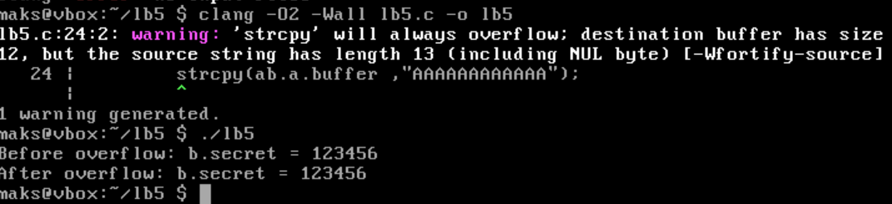
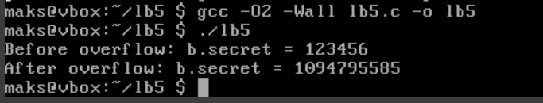

# Практична робота №5

# [10 варіант](lb5.c)

Потрібно реалізувати програму, яка перезаписує область пам’яті між двома структурами — і цей баг не проявляється на всіх компіляторах.

Скомпілюємо без оптимізації(```-O0```) і спробуємо запустити:


Добре, баг спрацював. При компіляції нас попередили про те, що ```b.secret``` зіпсовано через вихід за межі ```a.buffer```.

Я протестував компіляцію в ```gcc``` з ``` -O2 ```, ``` -O3 ``` та просто зкомпілювати без оптимізацій але результат нічим не відрізнявся від попереднього. 

Потім я спробував зкомпілювати в іншому компіляторі ```clang``` з оптимізацією:



Трапилося дещо цікаве! Новий компілятор усунув баг.
Щоб бути впевненим на 100%, я ще раз скомпілював той самий файл в ``` gcc ``` та з оптимізацією ``` -O2 ```:


Баг продовжує існувати в цьому компіляторі. Тепер черга протестувати ```clang``` без оптимізації:



Баг проявив себе і тут без оптимізації. Прочитавши в інтернеті різницю між ```clang``` і ```gcc``` компілятором і дізнався, що ```Clang``` набагато суворіше дотримується стандарту мови C, де будь-який UB ( undefined behavior (як ```buffer overflow```)) дає компілятору повне право "забити" на наслідки. Це може бути однією із причин такого ігнорування багу.